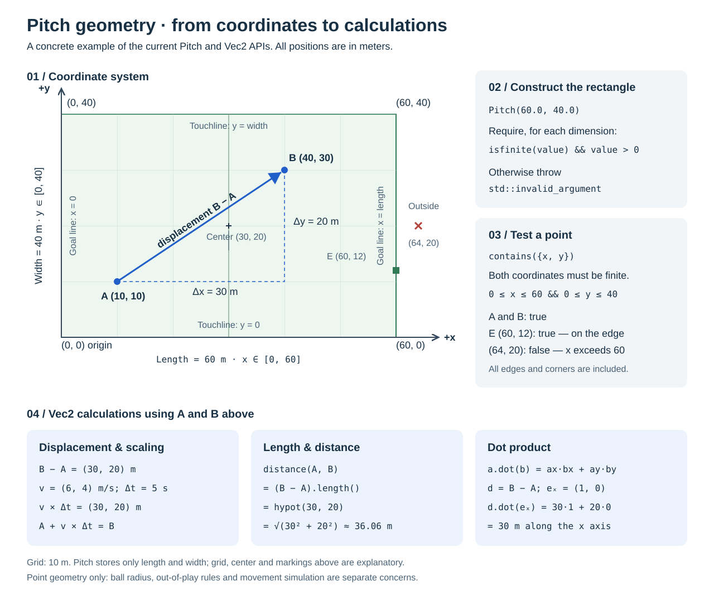

# Match geometry

`sim-match` is a standard C++23 static library with no Unreal dependency.
Consumers link `ElyverseFootball::sim-match` and include `pitch.hpp`.
The reusable `Vec2` value type lives in `sim-core` (`vec2.hpp`).

## Illustrated example

[Editable vector drawing](images/pitch-geometry.svg) · [PNG version](images/pitch-geometry.png)

The example connects `A = (10, 10)` to `B = (40, 30)`. Subtracting the
positions gives the displacement `(30, 20)` meters. Its length is
`std::hypot(30, 20)`, approximately 36.06 meters. A velocity of `(6, 4)`
meters per second multiplied by five seconds gives the same displacement;
this illustrates vector arithmetic, not an implemented movement system.

`Pitch` stores only the two dimensions. Grid lines, markings, the center,
and example points in the drawing illustrate the coordinate system; they are
not additional stored geometry. Boundary checks include a point on the edge
and reject a point beyond it, without applying ball radius or football rules.

## Coordinate system

- Positions and pitch dimensions are measured in meters.
- The origin `(0, 0)` is one corner of the pitch.
- The x axis follows the pitch length; goal lines are at `x = 0` and `x = length`.
- The y axis follows the pitch width; touchlines are at `y = 0` and `y = width`.
- The center is `(length / 2, width / 2)`.
- Coordinates stay fixed when teams change ends. Team attacking direction is a
  separate concern. Renderers map these coordinates to their own screen axes.

`Pitch(60.0, 40.0)` creates a 60 by 40 meter rectangle. These are example
dimensions, not a mandated 7v7 size. Both dimensions must be positive and finite;
invalid dimensions throw `std::invalid_argument`.

`Pitch::contains()` includes the edges and corners, without an implicit epsilon.
It returns false for positions containing NaN or infinity. It tests a point,
not the full ball: out-of-play rules, ball radius, and player movement constraints
are not part of this geometry API.

## Vector operations

`Vec2` stores two doubles by value and defaults to zero. It supports addition,
subtraction, scalar multiplication, dot product, length, squared length,
distance, and explicit finite-value checks. It has no owning pointers, dynamic
allocation, or indexed component access. Units follow the context: a position
uses meters, a velocity uses meters per second, and velocity multiplied by
seconds yields displacement.

Equality compares components exactly. Geometric tolerance checks should use an
explicit, context-specific tolerance. Arithmetic follows floating-point rules
and may produce non-finite results for extreme inputs; `isFinite()` allows those
results to be detected. Length uses `std::hypot` to avoid unnecessary intermediate
overflow or underflow when squaring components.

`lengthSquared()` returns the squared magnitude without the square root. Its unit
is the square of the component unit: meters squared for a position in meters.
Compare it against a squared threshold, never against a length. It orders
magnitudes exactly as `length()` does, and is exact where `length()` rounds, which
suits proximity and radius comparisons. Unlike `length()`, it squares the
components directly, so extreme inputs can overflow to infinity.

These primitives introduce no randomness. They do not promise bitwise-identical
floating-point results across different compilers or platforms.
