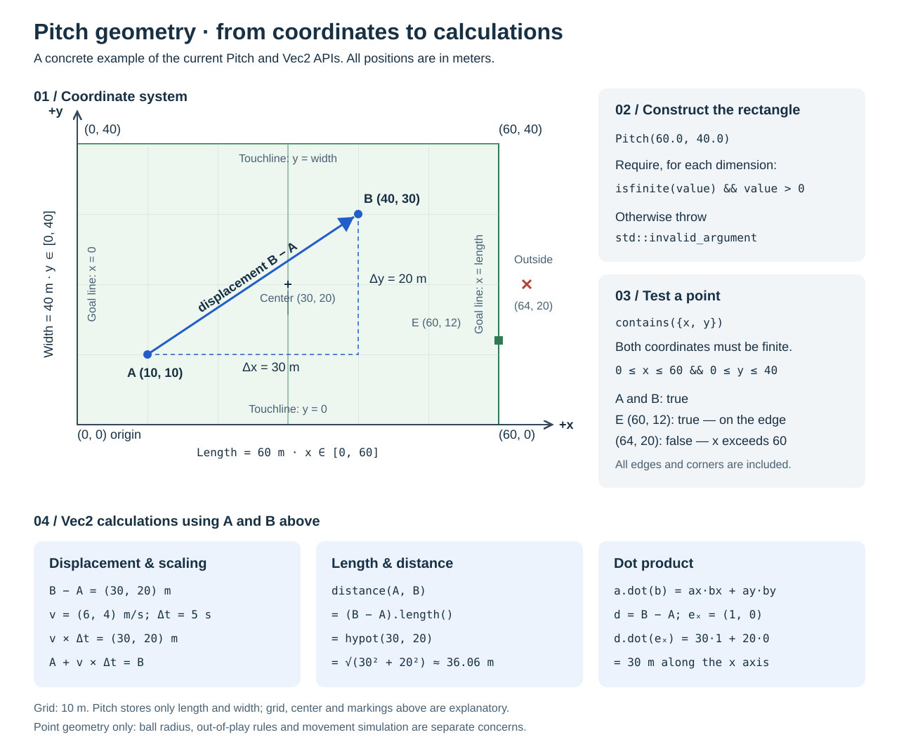

# Match geometry

`sim-match` is a standard C++23 static library with no Unreal dependency.
Consumers link `ElyverseFootball::sim-match` and include `pitch.hpp`.
The reusable `Vec2` value type lives in `sim-core` (`vec2.hpp`).

## Illustrated example

[Editable vector drawing](images/pitch-geometry.svg) · [PNG version](images/pitch-geometry.png)

The example connects `A = (10, 10)` to `B = (40, 30)`. Subtracting the
positions gives the displacement `(30, 20)` meters. Its length is
`(30, 20).length()`, approximately 36.06 meters. A velocity of `(6, 4)`
meters per second multiplied by five seconds gives the same displacement;
this illustrates vector arithmetic, not an implemented movement system.

`Pitch` stores only the two dimensions. Grid lines, markings, the center,
and example points in the drawing illustrate the coordinate system; they are
not additional stored geometry -- the markings below are derived from the
dimensions on demand. Boundary checks include a point on the edge
and reject a point beyond it, without applying ball radius or football rules.

## Coordinate system

- Positions and pitch dimensions are measured in meters.
- The origin `(0, 0)` is one corner of the pitch.
- The x axis follows the pitch length; goal lines are at `x = 0` and `x = length`.
- The y axis follows the pitch width; touchlines are at `y = 0` and `y = width`.
- The center is `(length / 2, width / 2)`.
- Coordinates stay fixed when teams change ends. Team attacking direction is a
  separate concern. Renderers map these coordinates to their own screen axes.

`Pitch(60.0, 40.0)` creates a 60 by 40 meter rectangle. These are example
dimensions, not a mandated 7v7 size. Both dimensions must be positive and finite;
invalid dimensions throw `std::invalid_argument`.

Two `Pitch` values compare equal when both dimensions match exactly; like `Vec2`,
the comparison applies no tolerance.

`Pitch::contains()` includes the edges and corners, without an implicit epsilon.
It returns false for positions containing NaN or infinity. It tests a point,
not the full ball: out-of-play rules, ball radius, and player movement constraints
are not part of this geometry API.

`Pitch::clamp()` returns the point on the pitch nearest to a finite position:
the position itself when `contains()` holds, otherwise its projection onto the
nearest edge or corner. Movement commands use it to keep targets on the pitch.

## Named sizes

Two sizes are named, and neither is imposed: any positive, finite pair of
dimensions builds a pitch.

- `kStandardLengthMeters` (105) and `kStandardWidthMeters` (68): standard
  eleven-a-side dimensions, the reference pitch the Laws of the Game state every
  marking for.
- `kSandboxLengthMeters` (60) and `kSandboxWidthMeters` (40): the sandbox size
  the seven-a-side fixtures and scenarios play on -- small enough to read in the
  debug viewer, not a mandated 7v7 size.

## Markings

`Pitch::markings()` derives the lengths every marking is built from, in meters,
from the two dimensions alone. `Pitch` stores nothing but the dimensions: the
markings are computed on demand, two pitches with the same dimensions have the
same markings, and `operator==` therefore still compares the dimensions only.

The Laws fix every marking and give a range only for the pitch itself, so the
dimensions are the only thing to configure. `kStandardMarkings` holds the Laws'
own numbers, which a pitch of another size scales:

| Marking | At the standard pitch | Scales with |
| --- | --- | --- |
| `goalWidthMeters` | 7.32 | the width |
| `goalHeightMeters` | 2.44 | the width |
| `penaltyAreaDepthMeters` | 16.5 | the length |
| `penaltyAreaWidthMeters` | 40.32 | the width |
| `goalAreaDepthMeters` | 5.5 | the length |
| `goalAreaWidthMeters` | 18.32 | the width |
| `penaltySpotDistanceMeters` | 11 | the length |
| `centerCircleRadiusMeters` | 9.15 | the smaller factor |
| `cornerArcRadiusMeters` | 1 | the smaller factor |

The penalty area is 16.5 meters deep and reaches 16.5 meters to either side of
the goal (16.5 + 7.32 + 16.5 = 40.32); the goal area does the same with 5.5
(5.5 + 7.32 + 5.5 = 18.32).

Depths scale with the length, widths across the pitch with the width, and the
two radii with the smaller of the two factors, so a circle stays a circle
instead of becoming an ellipse. Because each standard marking is smaller than
the standard pitch in the direction it scales with, every derived marking fits
inside its pitch, however small or lopsided: the 60 by 40 meter sandbox pitch
gets a 4.31 by 1.44 meter goal, a penalty area 9.43 meters deep and 23.72 wide,
and a center circle of radius 5.23. At 105 by 68 both factors are exactly one,
so the markings are the Laws' numbers bit for bit.

Markings are geometry, not rules. Nothing in the simulation treats a line as a
boundary by itself; offside, penalties and goals are rules built on top of this
geometry, and none of them exists yet.

## Goals, areas, spots and arcs

Both goals are named by the goal line they stand on, `GoalEnd::kMinX` for
`x = 0` and `GoalEnd::kMaxX` for `x = length`. Pitch coordinates stay fixed when
teams change ends, so an end says nothing about which side defends it.

- `goalLineX(end)` is 0 or the length; `center()` is the middle of the pitch.
- `goal(end)` is the frame: the middle between the posts on the goal line, the width
  between the posts, and the height to the underside of the crossbar.
  `postAtMinY()` and `postAtMaxY()` are the two posts, at the lower and the
  higher pitch y. Posts and crossbar have no thickness of their own.
- `penaltyArea(end)` and `goalArea(end)` are `PitchRect`s reaching from the goal
  line into the pitch, centered on the goal; `penaltySpot(end)` lies on the
  goal's center line.
- `centerCircle()` is a `PitchCircle`. `cornerArc(corner)` is the full circle
  the arc is a quarter of: a position is in the arc when it is inside that
  circle and on the pitch. `PitchCorner` names a corner by the goal line and the
  touchline it lies on, `cornerPosition(corner)` gives the corner itself.

`PitchCircle::contains()` includes the edge and rejects non-finite points, the
way `PitchRect::contains()` and `Pitch::contains()` do. It compares the
`length()` of the offset against the radius rather than
their squares, so it stays correct on the extreme pitch sizes where squaring
would overflow or underflow. Heights are meters above the ground and are the one
quantity a caller supplies rather than reads: the simulation is otherwise flat,
and no state stores a height yet.

`Goal::framesPoint(pitchY, height)` answers whether a point is inside the frame:
`isBetweenPosts()` and `isUnderCrossbar()` both hold, so a point beside a post
or above the crossbar misses. Both edges are included -- a point exactly on a
post or against the underside of the crossbar is framed -- and neither says
anything about whether a ball crossed the line or which way it travelled. That
is for shot and rule code to decide.

## Distance and open angle to a goal

Three helpers exist for shot and goalkeeper code:

- `isInPenaltyArea(end, position)` includes the area's lines, like every other
  containment check here, and is false for a non-finite position.
- `distanceToGoalMeters(end, position)` is the distance to the nearest point of
  the goal -- the line between the posts, not its center -- so it is zero
  between the posts and runs to the nearer post from beside it. A non-finite
  position gives a non-finite distance.
- `goalAngleRadians(end, position)` is the angle in `[0, pi]` that the goal
  subtends at a position: how much goal there is to shoot at. It is widest in
  front of the center, narrows toward the posts and with distance, is `pi`
  between the posts and zero on a post or for a non-finite position. It
  is the open angle of an empty pitch -- nobody blocks it -- and a position
  behind the goal line gets the same angle as its mirror image, so callers check
  where they stand themselves.

The angle uses `SimCore::stableArcTangent()` rather than `std::atan2`, for the
same reason perception computes its own cosine and `sim-core` its own
exponential: the standard functions need not be correctly rounded, and a
last-bit difference between two machines would be enough to rate the same shot
differently and make a replay diverge. `stableArcTangent()` works from basic
arithmetic and `std::sqrt`, both correctly rounded, and is accurate to a few
units in the last place.

`Vec2::length()`, and with it `SimCore::distance()`, the goal distance and
the circles' containment, uses `SimCore::stableHypot()` rather than `std::hypot`:
that too need not be correctly rounded. `stableHypot()` is exactly
`std::sqrt(x * x + y * y)` wherever the squares are safe and scales both
components by an exact power of two first where they would overflow or
underflow.

## Vector operations

`Vec2` stores two doubles by value and defaults to zero. It supports addition,
subtraction, scalar multiplication, dot product, length, squared length,
distance, and explicit finite-value checks. It has no owning pointers, dynamic
allocation, or indexed component access. Units follow the context: a position
uses meters, a velocity uses meters per second, and velocity multiplied by
seconds yields displacement.

Equality compares components exactly. Geometric tolerance checks should use an
explicit, context-specific tolerance. Arithmetic follows floating-point rules
and may produce non-finite results for extreme inputs; `isFinite()` allows those
results to be detected. Length uses `SimCore::stableHypot()`, which is
bit-identical on every platform and avoids intermediate overflow or underflow
when squaring components.

`lengthSquared()` returns the squared magnitude without the square root. Its unit
is the square of the component unit: meters squared for a position in meters.
Compare it against a squared threshold, never against a length. It orders
magnitudes exactly as `length()` does, and is exact where `length()` rounds, which
suits proximity and radius comparisons. Unlike `length()`, it squares the
components directly, so extreme inputs can overflow to infinity.

These primitives introduce no randomness. They do not promise bitwise-identical
floating-point results across different compilers or platforms.
